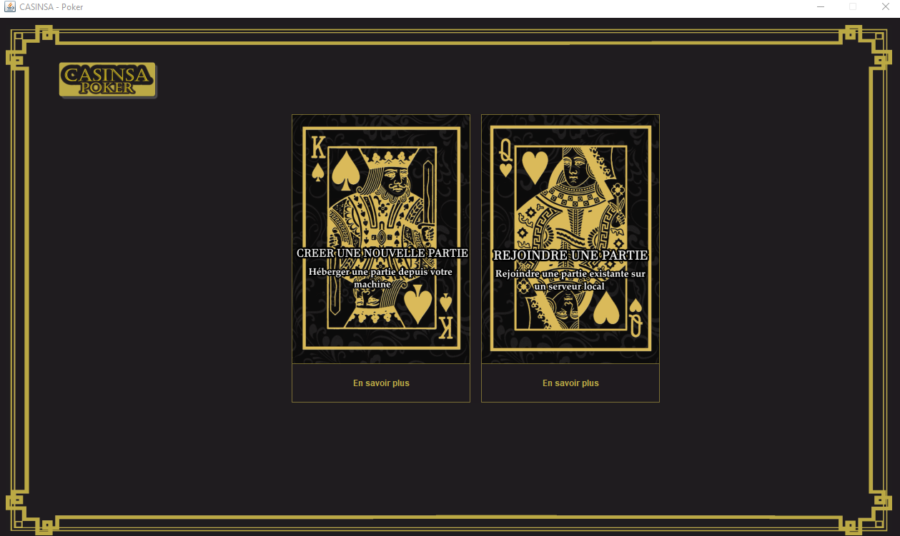
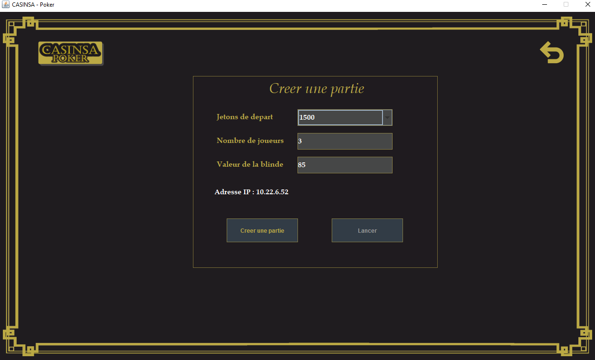
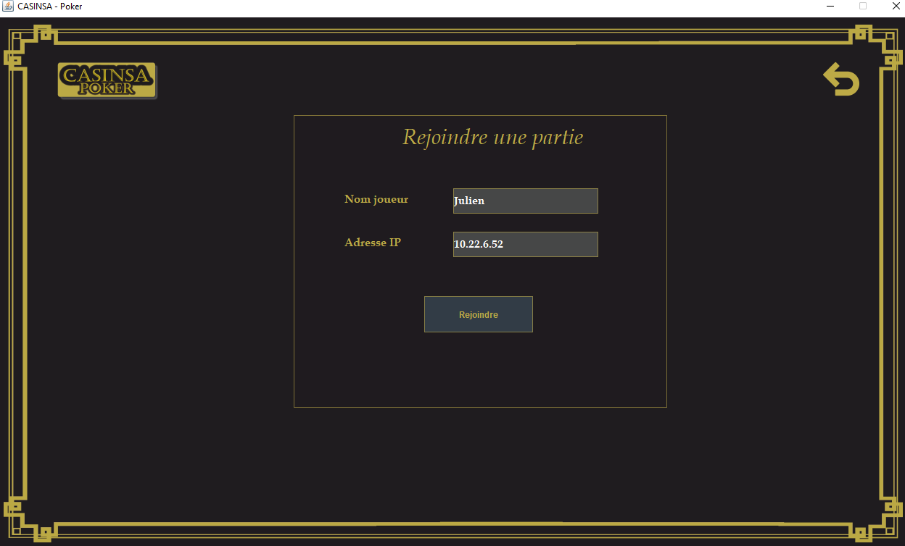
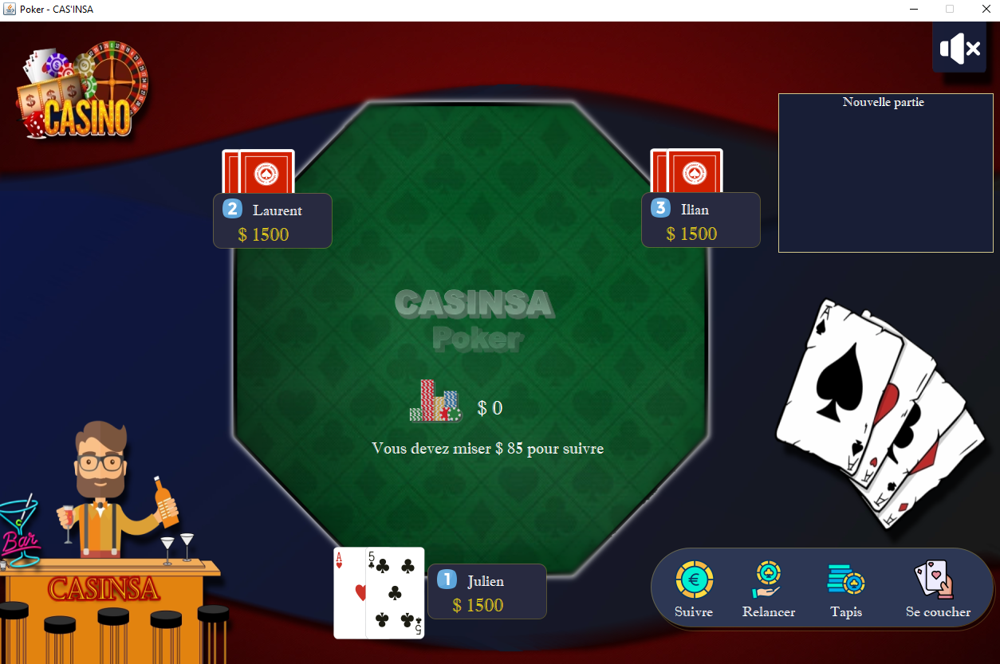
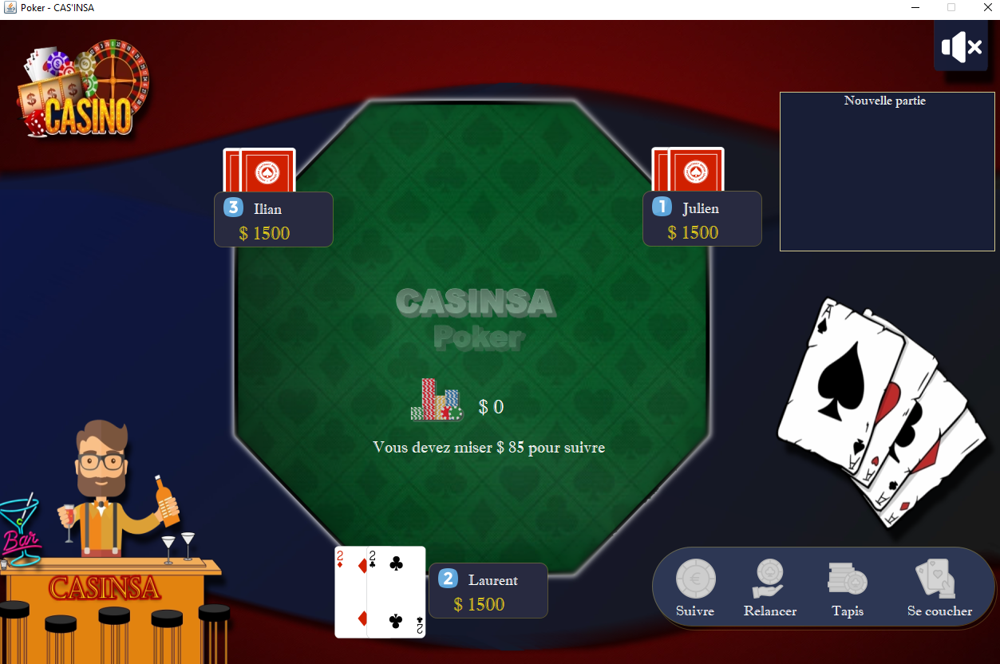
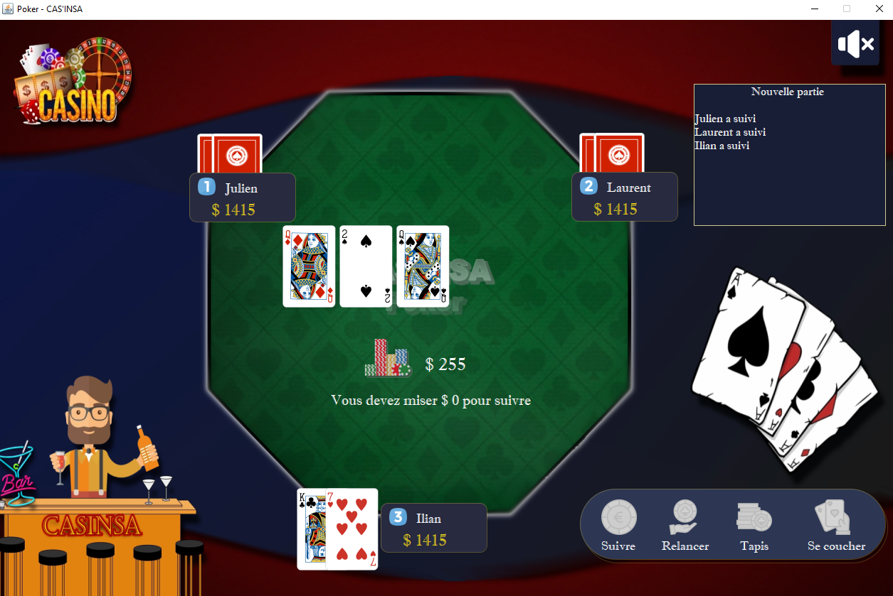

# Local Multiplayer poker game

This is a local multiplayer poker game that can be played by 2 to 8 people.
There some features of real poker which are not included in this game.

>**Note :** This game and the code are in french!

## Launch
Execute the poker.jar file in the src folder

## Usage
**Note :** Host and players should all be connected to the same local internet connexion. Players can be on the same computer or on different ones

### Server side
1. Once the application launched click on create a new server and fill all the parameters then hit create a new game

2. Once all players have joined the game click Start and the game should start

### Player side
1. Once the application launched click on join a game
2. Then enter your name or nickname and enter the ip adress for the server

3. Wait for the host to start the game and enjoy

## In-game pictures

